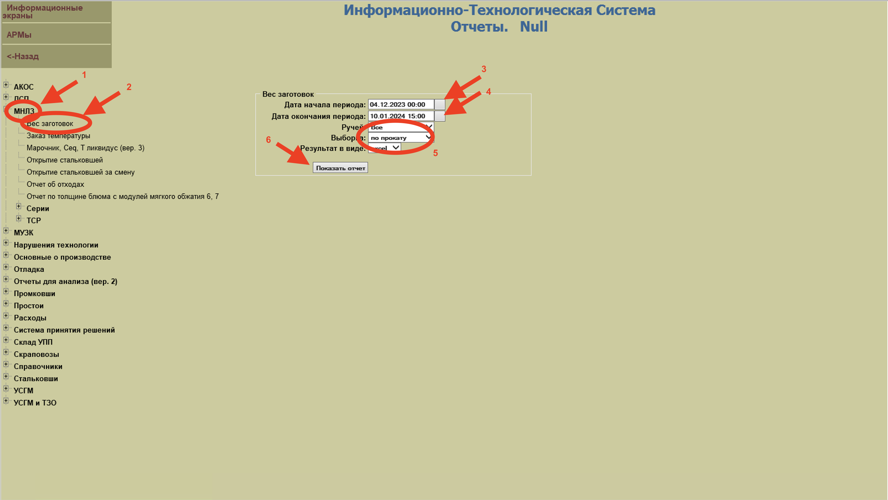

# Препроцессинг

## Общая информация
Формирование набора данных для обучения из:
- [агрегированых значений](https://tfs.msk.evraz.com/tfs/%D0%9F%D0%BE%D1%80%D1%82%D1%84%D0%B5%D0%BB%D1%8C%20%D0%BF%D1%80%D0%BE%D0%B5%D0%BA%D1%82%D0%BE%D0%B2/%D0%A6%D0%B8%D1%84%D1%80%D0%BE%D0%B2%D0%B0%D1%8F%20%D1%82%D1%80%D0%B0%D0%BD%D1%81%D1%84%D0%BE%D1%80%D0%BC%D0%B0%D1%86%D0%B8%D1%8F.%20%D0%92%D0%BE%D0%BB%D0%BD%D0%B0%202/_wiki/wikis/9684%20%D0%A1%D0%9A%D0%A0%D0%9F%20-%20dev/7883/signals) по длине (весь рельс, первые три метра, последний метр, с n-го по n+m метр и т.д)
- единичных значений 

## Вход

1) Файл [settings.xlsx](тут должна появиться ссылка) с описанием агрегатов, методов агрегаций, точек на рельсах и т.д.
2) Файлы метаданных:
   1) Хранятся по пути \\ZSMK-9684-001\Data\DS\metadata
   2) Добавление новых данных при помощи [ресурса](http://oas7.sib.evraz.com/espc-report-pls/ActionMain.do?arm=1828)
   

## Выход

N файлов формата датасета (одному рельсу соотвествует одна строка таблицы)

##  Инструкция (описать как использовать)